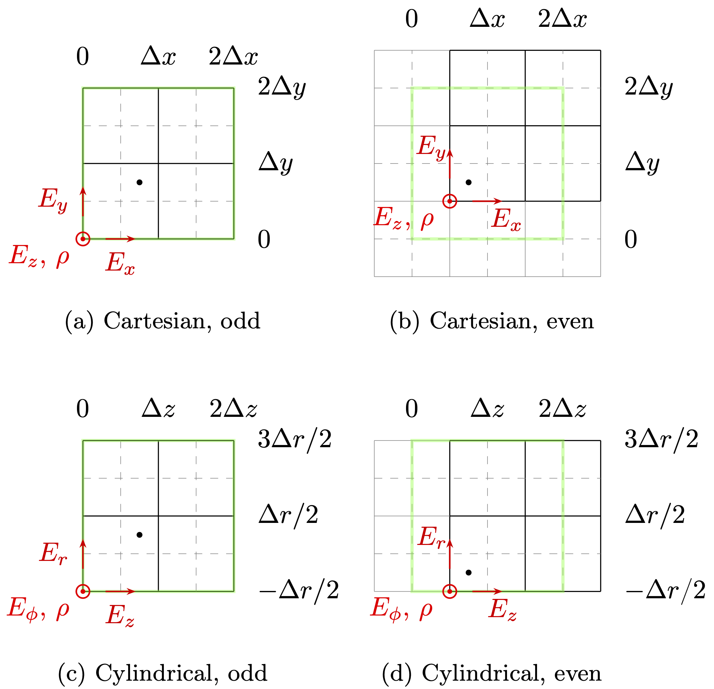
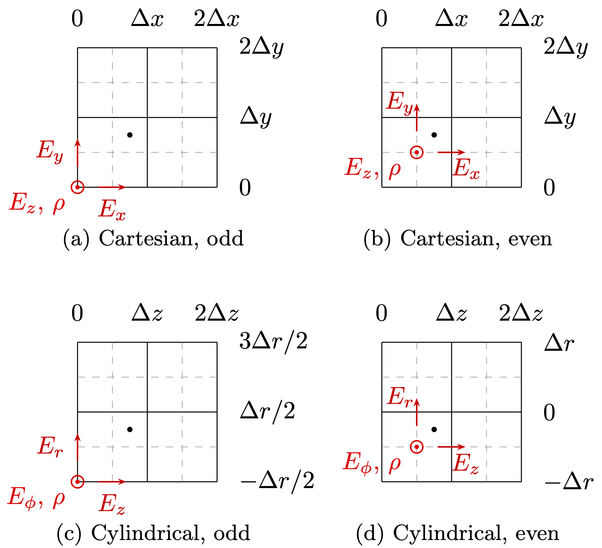

# On the position of field quantities and physical boundaries in OSIRIS

## Current implementation

* A simulation cell does not change with interpolation level, and apart from initialization, the values of `xmin` and `xmax` are irrelevant for the simulation.
  * Below we discuss that the spatial position of cells is shifted by `+0.5*dx` for even-level interpolation.
* Charge is always defined in the lower corner of the cell; all other quantities use a staggered (Yee type) grid arrangement, e.g., `Ex` is placed halfway along the lower `x` cell boundary.
  * Diagnostics can/should include a position offset for each quantity as metadata.
* Particle index positions, `ix`, refer to different cell coordinates depending on interpolation level:
  * For odd-level interpolation `ix` refers to the lower neighbor charge point.
  * For even-level interpolation `ix` refers to the nearest neighbor charge point.
  * For charge deposition the following grid points will be used:

| Interpolation | Charge points |
| ------------- | ------------- |
| Linear        | `ix`, `ix+1` |
| Quadratic     | `ix-1`, `ix`, `ix+1` |
| Cubic         | `ix-1`, `ix`, `ix+1`, `ix+2` |
| Quartic       | `ix-2`, `ix-1`, `ix`, `ix+1`, `ix+2` |

* Particle position inside the cell, `x`,  is always normalized to cell size, with values in the range `-0.5 <= x < 0.5`.
  * This choice of values prevents critical roundoff errors when particle crosses cell boundary, and has minimal overhead (only +1 op for linear interpolation, no overhead in other situations) .
* A simulation box with `nx` cells and a `[xmin, xmax]` range:
  * Has a cell size is `dx = (xmax-xmin)/nx` .
  * The `xmin` coordinate corresponds to the lower edge of the simulation space.
  * The `xmax` coordinate corresponds to the upper edge of the simulation space.
* For the core algorithm (particle push + field solver), one simulation node with `n` cells is responsible for:
  * Solving for field values in cells 1 to `n`. This means that field values that lie in the upper edge of the last cell should be handled by another node or by boundary conditions.
  * Pushing particles whose index position is in the range 1 to `n`. Particles that fall outside this range must be sent to another node or handled by boundary conditions.

### Boundaries (except for axial boundary on cylindrical/quasi-3D geometries)

(This is where it gets tricky)

* For performance reasons the physical boundary is defined where the particle position index `ix` falls below 1 or goes over `nx`.
  * This greatly simplifies processing particle boundaries because we only need to test `ix` (and not `x`), with significant performance impact.
* This means that the position of the physical boundaries depends on the interpolation level:
  * For odd interpolation levels physical boundaries are located at the lower edge of the first cell and upper edge of the last cell. In this case the charge point at cell 1 is positioned at `xmin`, and the charge point at cell `nx` is positioned at `xmax - dx`.
  * For even interpolation levels physical boundaries are located at the centers of the first lower guard cell and last cell. In this case the charge point at cell 1 is positioned at `xmin + dx/2`, and the charge point at cell `nx` is positioned at `xmax - dx/2`.
* The code for PEC and PMC boundaries is aware of this, as are the physical boundary conditions for particles and the reflecting code for currents.
* The VPML code does not change according to this, but it has no impact on the simulation.
* The axial boundary is a special case, as it must be in a specific position (center of the central radial cell). For the old cylindrical geometry this is handled inside the particle 3D push and the field solver.

### Visualization

Below we show OSIRIS field and particle discretization for various geometries and particle interpolation levels.  All simulations are of size 2x2 cells with `(xmin,xmax) = (0,2∆x)` in each dimension (including in the r-direction in cylindrical geometry).  We could also think of the schematics as referring to the lower-left corner of a larger simulation.  Solid black lines are OSIRIS simulation cells (with charge located at the bottom-left corner), the green box indicates the physical simulation boundaries, light gray solid lines represent guard cell boundaries and light gray dashed lines represent half-cell locations.  Red field quantities are shown for the first simulation cell, (1,1), and a single black dot represents a hypothetical particle indexed as `ix = (1,1)` and `x = (0.25,0.25)`.

## Initialization and diagnostics

* The spatial position of grid points, when measured from `xmin`, depends on the interpolation level:
  * For even-level interpolation it is shifted by `+0.5*dx` when compared to odd-level interpolation.
  * Initialization routines (fields/particles) *should* take this into account (although you will get at most a half-cell offset). Internally this can be achieved simply by shifting the values of `xmin` and `xmax` by `+0.5*dx` before calculating positions of grid field points.
* For even-level interpolation, this should impact diagnostic output also:
  * This can be accomplished by either shifting the `xmin` / `xmax` values or adding `+0.5` to included offset metadata.
  * In an effort to keep the `xmin` / `xmax` values of diagnostic data consistent with those set in the input deck, we choose to appropriately set the offset metadata included in diagnostic data. Particle positions for RAW/track diagnostics should be consistent with this choice and should always fall in the range `[xmin, xmax]`.
  * For 2D colormap plots (similar discussion for 3D plots) one must appropriately draw the cells.

### Diagnostic metadata

Here we discuss the specific metadata added to hdf5 files dumped from OSIRIS.  In short, for the ith axis of the data, the reported values are centered at `axis(i).min + (offset_x(i) + n) * dx(i)` for an axis with spacing between points of `dx(i)` and successive points numbered by `n` along the axis.  The reported values are centered at time `TIME + offset_t * dt` for the included simulation time, `TIME`, and simulation time step, `dt`.

* **Spatial vdf data**

  This includes fields, currents and particle/species reports (e.g., `e1`, `j2`, `charge`, etc.). For a vdf file with `ndims` dimensions, each dimension has a corresponding axis object with a minimum/maximum value, `xmin` / `xmax`. Thus the corresponding grid spacing for an axis is `dx = (xmax-xmin)/nx`, where `nx` is the number of points along a given axis.  Each file also contains a `TIME` value corresponding to the simulation time for the iteration when data was dumped.  We add the following metadata to each vdf:
  - `offset_x(1:ndims)`, real: Specifies for each axis the location of the reported quantity relative to the left cell edges (located at `xmin`, `xmin+dx`, ..., `xmax-dx`) in units of `dx`.
    + For example, a 2D simulation with odd-level interpolation, the `e1` report would have `offset_x = (0.5, 0.0)` and the `e3` report would have `offset_x = (0.0, 0.0)`.
    + For a 2D simulation with even-level interpolation, the `e1` report would have `offset_x = (1.0, 0.5)` and the `e3` report would have `offset_x = (0.5, 0.5)`.
  - `offset_t`, real: Specifies the offset in time of the reported quantity in relation to the included simulation time, `TIME`, in units of the simulation `dt` value.
    + For example, `e1` and `b1` have `offset_t = 0.0` (magnetic fields are maintained within the code at the same time step as electric fields), but `j1` has `offset_t = -0.5`.
    + As another example, time-averaged data will exhibit a variable `offset_t` paramater.  The `e1` report averaged over 5 time steps will have `offset_t = -2.0`, while the `j1` report averaged over 5 time steps will have `offset_t = -2.5`.

* **Phasespace data**

  In addition to the same `offset_x(1:ndims)` and `offset_t` parameters described in the vdf section, we also include the following metadata:
  - `offset_t_axes(1:ndims)`, real: Specifies for each axis the offset in time (in units of `dt`) of the reported quantity in relation to the included simulation time, `TIME`.
    + For example, the phasespace `gp2x1` will have `offset_t_axes = (0.0, -0.5, -0.5)` (note that the axes order is reversed from the phasespace name).
    + All phasespace diagnostics have `offset_x(1:ndims) = 0.5`.  This is because the axes lower/upper bounds specify the bin edges, and the actual data points are centered within those bins.

* **Raw particle and tracking data**

  Raw and tracking data don't have axes members like vdf or phasespace data.  Instead, each quantity out of `nquants` total quantities is simply reported at various time steps.  For these files, we add the following metadata:
  - `offset_t(1:nquants)`, real: Specifies for each quantity the offset in time (in units of `dt`) of the reported quantity in relation to the included simulation time, `TIME`.
    + For example, raw particle data from a 1D simulation with quants `(x1, p1, p2, p3, q, ene)` will have `offset_t = (0.0, -0.5, -0.5, -0.5, 0.0, -0.5)`.

## Alternative interpretation

Here we provide a (hopefully) helpful alternative way of thinking about cells in OSIRIS.  Because the code was restructured for particle boundaries to require only the testing of `ix`, another intuitive picture of OSIRIS is to consider particles as living in cells with constant `ix`.  In this view, the particle "cells" never shift with interpolation level (only for even interpolation in the cylindrical geometry).  For odd (even) interpolation levels, charge is defined at the lower-left (center) of the particle cell.

Below we show this alternative view of OSIRIS field and particle discretization for various geometries and particle interpolation levels.  All simulations are of size 2x2 cells with `(xmin,xmax) = (0,2∆x)` in each dimension (including in the r-direction in cylindrical geometry).  We could also think of the schematics as referring to the lower-left corner of a larger simulation.  Black lines are cells to which particles are indexed (as opposed to simulation cells), i.e., all particles within a solid black square have the same ix value.  Red field quantities are shown for the first simulation cell, (1,1), and a single black dot represents a hypothetical particle indexed as `ix = (1,1)` and `x = (0.25,0.25)`.  Note the shift of the radial coordinates for even interpolation in the cylindrical geometry: no particles are allowed in the cell with `ix_r = 1`, and no particles are allowed past `∆r`.

## Notes

* Values on the first/last cell may or may not be edge values depending on the interpolation level.
* Most initializations and diagnostics have been verified to be functioning properly (independent of interpolation level), but there are most likely still issues for some cases.