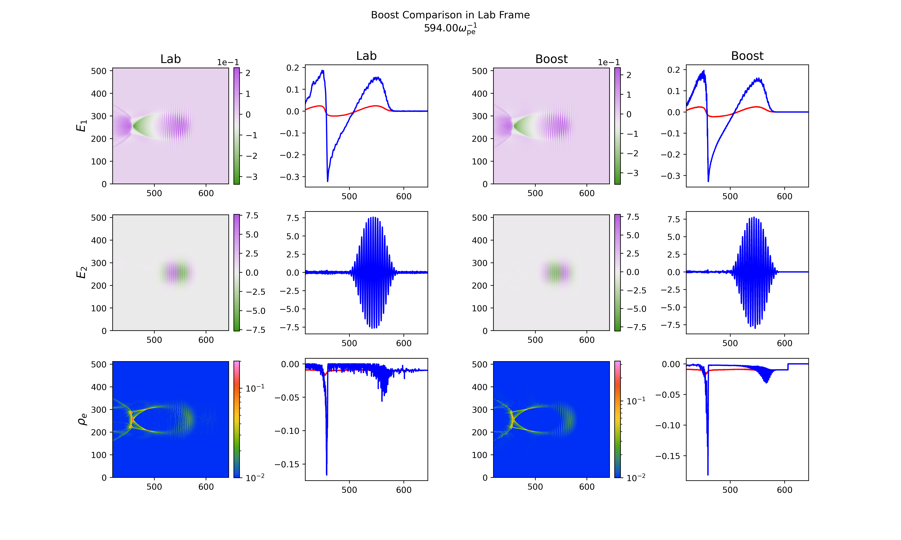

# Lorentz-Boosted Particle-in-Cell Simulations

## Introduction

### Motivation

Consider a particle-in-cell (PIC) simulation of a typical laser wakefield acceleration (LWFA) system in the lab frame. The largest degree of scale separation is typically given by the ratio of the final simulation time $t_\text{max}$ to the timestep $\Delta_t$. The latter is determined by the need to resolve the laser period, i.e., $\Delta t \ll \lambda_0/c \equiv 2 \pi / \omega_0$. Thus, the ratio of the largest to smallest scales is proportional to $\omega_0 t_\text{max}$. What would happen if we were to simulate the system in a Lorentz-boosted frame with velocity $\beta$ (and corresponding Lorentz factor $\gamma$) copropagating with the laser in the $z$-direction?? The plasma would be Lorentz-contracted by a factor of $\gamma$ and have a drift velocity of $-\beta$, so that $t_\text{max}' \sim t_\text{max} / \gamma(1+\beta)$. The laser wavelength would be redshifted so that $\lambda_0' = \lambda_0 \cdot \gamma(1+\beta)$. Thus, the temporal scale separation in the boosted frame would then be $\omega_0' t_\text{max}' = \gamma^2 (1+\beta)^2 \omega_0 t_\text{max}$. Because of the reduced temporal scale separation, one would expect a computational speedup on the order of $4 \gamma^2$.

The Lorentz factor $\gamma$ cannot be increased arbitrarily. Reasons for this will be discussed below. However, we will see that $\gamma$ can potentially be increased for typical LWFA problems to $\gamma > 10$, or a theoretical speedup of more than 400. So, what's stopping us from simulating everything in a boosted frame? The answer is that running the simulation in the boosted frame presents a variety of challenges. Chief among these is the Numerical Cherenkov Instability (NCI), which, if unsuppressed, leads to exponential growth of fields on timescales far shorter than $t_\text{max}'$. There are also a number of complications for simulation initialization and diagnostics which must be considered.

The complications of the NCI, initialization, and diagnostics are all addressed at the software level in OSIRIS. Hence, Lorentz-boosted simulations of LWFA or other processes benefiting from boosting can be run. However, when running in this simulation configuration, it is important to understand the subtleties of these complications. The purpose of this document is to explain these subtleties.


### What is the maximum $\gamma$ that can be applied?

We begin by considering the maximum $\gamma$, because this gives a sense of the potential speedup that can be obtained with boosted simulations. Again, we consider the case of LWFA. For the field solvers in OSIRIS, the maximum $\gamma$ is constrained by the CFL condition: $\Delta_t'$ will become limited by $\Delta_{x_\perp}' = \Delta_{x_\perp}$ instead of $\Delta_z'$ as the boost is increased. The maximum speedup will be close to the boost that makes $\Delta_z' = \Delta_{x_\perp}'$ in the boosted frame. For a typical lab-frame resolution of $\Delta_z = \lambda_0/30$ and $\Delta x_\perp = k_p^{-1} / 10$, the maximum speedup will occur for a boost of $\gamma = \frac 1 4 \left( \frac{\omega_0}{\omega_p} \right)$, which would yield a theoretical speedup of $\frac 1 4 \left( \frac{k_0}{k_p} \right)^2$. Such a speedup could be very large for realistic laser parameters, potentially enabling simulations that would otherwise be impossible.

In practice, the speedup is generally significantly less than the heuristic theoretical speedup of $\frac 1 4 \left( \frac{k_0}{k_p} \right)^2$. This is because the true speedup is lower when one performs a more-accurate analysis of the theoretical speedup (accounting for the spatial dimensions) and also because of IO and other sources of simulation overhead. For example, at the time of writing (August 2024), replications of the simulation from [Lu2007] yield a heuristic theoretical speedup of $\sim 300$, a more-accurate theoretical speedup of $\sim 70$, and an actual speedup of $\sim 20$.


### When is a Lorentz-boosted simulation beneficial?

A necessary condition for the boosted frame to be useful is that the system timescale is decreased and the simulation timestep is increased in the boosted frame. Because of the constraint of the CFL condition, the transverse cell size must also be larger than the longitudinal cell size in the lab frame. These restrictions mean that the number of problems for which a boosted frame can be helpful is quite limited. LWFA simulations are the prime candidate, but may not benefit if a high transverse resolution is required. PWFA simulations typically will not benefit, but may under special circumstances, e.g., if a laser is included.


### Brief Review and Current Status in the Field

A complete review of work on the problem is beyond the scope of this document, but here we include some brief details. It was recognized in the early 1990s that simulation of LWFA in a boosted frame could lead to very large speedups. Initial work (unpublished, to our knowledge) found that the method worked in 1D Cartesian geometry. However, in 2D and 3D, the simulation fields mysteriously blew up. The numerical instability was eventually identified as the Numerical Cherenkov Instability (NCI). The NCI had been first analyzed in a different context by B. Godfrey in Ref. [Godfrey1974]. There was not much progress in dealing with the NCI until the late 2000s, when some results were published in which aggressive current filters were applied. Throughout the 2010s, various field solvers were developed which were designed to mitigate the NCI (and numerical dispersion more generally).

At this point, the NCI has largely been addressed. However, at the time of writing in 2024, Lorentz-boosted simulations remain under-utilized. Here are a number of the author's guesses as to why this may be:
* Not all PIC codes include NCI-suppressing solvers
* Not all PIC codes include algorithms for laser, beam, and plasma injection in a boosted frame
* Not all PIC codes support boosted diagnostics for lab-frame time-slice reconstruction in a boosted frame
* The simulation initialization is significantly more complex than in the lab frame
* There can be subtle differences in the physics, which require further research to understand

Although the NCI was historically the main bottleneck to getting boosted-frame plasma-based acceleration (PBA) simulations to run, these subtle details of initialization and diagnostics are still nontrivial. As a case in point, only a small part of this document deals with addressing the NCI (in the field solver section); almost all of the rest of the document discusses technical details of initialization and diagnostics.


### Implementation Status in OSIRIS

The current `dev` branch of OSIRIS supports boosted-frame simulations. An example comparison between lab- and boosted-frame OSIRIS simulations of LWFA in 2D showing outstanding agreement is shown here: 

At the time of writing, the following features are supported:
* NCI-suppressing solvers (dual solver, bump solver)
* Cathode injector for drifting plasma
* Moving-wall laser injector
* Thawing-beam injector (via moving plane)
* 1D, 2D, 3D, rz, and quasi-3D geometries
* Boosted grid diagnostics (i.e., lab-frame time-slice reconstruction for field and plasma distribution function moments), including slices
* Boosted raw particle diagnostics (i.e., lab-frame time-slice reconstruction for raw particle data)

The following features are not yet supported for boosted-frame simulations:
* Boosted particle phasespace diagnostics
* Ionization
* QED


### Outline of the Rest of the Document

The rest of the document contains details about how to set up Lorentz-boosted simulations in OSIRIS. Various aspects of simulation initialization and diagnostics are discussed. A script is included [here](https://github.com/millerk123/osiris-tools/tree/extra-inputs/boostdeck) to transform a lab-frame input deck to a boosted-frame deck, where all necessary conversions are performed automatically. In the author's opinion, it is still important for one running a simulation to have a general understanding of how the initialization works, even when using the input deck generator.


## Initialization of Lorentz-Boosted Simulations

Here we give an overview of mathematical and computational considerations for various aspects of initializing Lorentz-boosted simulations of PBA.

### NCI suppression through customized field solvers

As mentioned in the introduction, the NCI induced by a quasi-neutral drifting plasma is the primary numerical challenge to running Lorentz-boosted simulations of PBA. OSIRIS provides several field solvers for suppression of the NCI. One example is the "bump" solver, which modifies the dispersion relation of electromagnetic waves directed along the axis at the specific wavenumber where the NCI occurs [Li2017]. This solver was specifically designed to suppress the NCI. Another example is the "dual" solver, which was designed for general-purpose reduction of numerical dispersion for electromagnetic waves along the axis [Li2021]. Although it was not specifically designed for suppression of the NCI, it was later discovered that it naturally suppresses the NCI even better than the bump solver. Therefore, at the time of writing, it is recommended to use the dual solver for boosted-frame simulations. One can use the dual solver by adding the following lines to an OSIRIS input deck:

```
el_mag_fld
{
    solver = "fei",
}

emf_bound
{
    type(1:2,1) = "lindman", "lindman",
    type(1:2,2) = "axial", "open",
}

emf_solver
{
    type = "dual",
    solver_ord = 2,
    n_coef = 16,
    weight_n = 10,
    weight_w = 0.3,
    filter_limit = 0.6,
    filter_width = 0.1,
    n_damp_cell = 10,
    filter_current = .true.,
    correct_current = .true.,
}

```

The author's experience suggests that the above parameters should be sufficient for the vast majority of cases. If the NCI is still suspected to be an issue, it may be able to be addressed by changing the parameters. The normal procedure for doing this would be to use a script to compute the numerical dispersion relation of the solver. The dispersion relation depends on the above set of parameters as well as the plasma density, drift gamma, timestep, and cell sizes. One can try experimenting with the parameters to find a field solver with a dispersion relation such that the NCI growth rate is sufficiently low. The script for doing this is not included here. This procedure should be unnecessary for the vast majority of users.


### Boundary Conditions

It is recommended to always run Lorentz-boosted simulations of PBA in a moving window. This is typically the most natural choice, since the Lorentz transformation of a moving window in the lab frame is a moving window in any boosted frame (see the section on Simulation Box Boundaries). In addition, the OSIRIS boundary conditions (other than periodic boundary conditions) are not equipped to handle large plasma outflows. In this case, fields can blow up at the boundary and propagate into the box when this happens. When running a boosted-frame simulation without a moving window, it is usually inevitable that there will be a large outflow in the propagation direction unless the box is made much larger than necessary. Using the moving window addresses this because the outflow becomes causally disconnected from the simulation domain.


### Simulation Box Boundaries

The simulation box size can be determined by applying Lorentz transformations to the boundaries of the computational spacetime domain in the lab frame. In what follows, the boosted- and lab-frame coordinates will be respectively primed and unprimed. We will work everything out in the case that both simulations are run in a moving window, but the analysis can be repeated for a general case (although this configuration is not recommended).

Suppose that the lab-frame simulation starts with $z \in [z_-, z_+]$, runs for $t \in [ t_-, t_+]$, and runs with a moving window. (Typically, $t_- = 0$.) Assume also that the simulation can be initialized at any point outside the causal light cone of an interaction point $(t_\*, z_\*)$ -- for example, in an LWFA simulation, this is the point in spacetime at which the laser hits the plasma. Assume that the laser and the plasma can be analytically initialized outside of a light cone propagating with speed $c$ from this point. It will become clear why this is important in the sections on initialization of laser pulses and particle beams.

What are the spatiotemporal boundaries of a Lorentz-boosted simulation to contain all the dynamics beyond the interaction point? We can find them algebraically by applying Lorentz transformations. First, what is the time $t_+'$ up to which the boosted-frame simulation must be run? The boundaries of the simulation in spacetime at the end of the lab-frame simulation are $(t_{b\pm},z_{b\pm}) = (t_+, z_\pm + (t_+ - t_-) )$. Applying a Lorentz transformation, the boosted coordinates are $(t_{b\pm}',z_{b\pm}') = ( \gamma t_+ - \gamma \beta ( z_\pm + (t_+ - t_-) ), \gamma ( z_\pm + (t_+ - t_- )) - \gamma \beta t_+ )$. Of these values, the one associated with $z_-$ has a larger $t'$. This $t'$ is the point up to which the boosted-frame simulation must be run if we are to capture the entirety of the $t_+$ timeslice. Therefore, we see that $t_+' = \gamma(1-\beta)t_+ - \gamma \beta (z_- - t_-)$.

Next, what is the time $t_-'$ at which the boosted simulation must be started? This comes from the interaction point. In the boosted frame, the interaction point occurs at $(t_\*', z_\*') =  ( \gamma t_\* - \gamma \beta z_\*, \gamma z_\* - \gamma \beta t_\*)$. Thus, the simulation must be started at (or before) $t_-' = t_\*' = \gamma t_\* - \gamma \beta z_\*$.

Finally, the box boundaries for the boosted simulation can be calculated from their known final positions. We know that, in the boosted frame, the box boundaries at time $t'$ are $z_{b'\pm}' = z_\pm' + (t' - t_-')$ for a box with $z' \in [z_-', z_+']$ and with $t_-'$ given above. To determine the initial box boundaries in the boosted frame $z_\pm'$, we can equate the above spacetime coordinates corresponding to the boosted-frame box with the transformed coordinates of the lab-frame box given previously, or $(t', z_{b'\pm}') = (t_{b\pm}',z_{b\pm}')$. Solving this equation for the initial boosted-frame box boundaries results in $z_\pm' = t_-' - t_{b\pm}' + z_{b\pm}' = t_-' + \gamma(1+\beta) (z_\pm - t_-)$.

All this has been worked out in full generality. In my experience, the most convenient way to center the simulation is to choose $t_- = 0$ and $(t_\*, z_\*) = (0,0)$ in the lab frame. When this is done, the box boundaries in the boosted frame simplify to $z_\pm' = \gamma(1+\beta) z_\pm$, with $t_-' = 0$ and $t_+' = \gamma(1-\beta) t_+ - \gamma \beta z_-$. The box is therefore longitudinally expanded by a factor of $\gamma(1+\beta)$. Note that $\gamma(1-\beta) = 1 / \gamma(1+\beta)$, so that the first term in the $t_+'$ expression represents a Lorentz contraction of the simulation timescale. This is the term corresponding to the heuristic timescale estimate in the introduction from length contraction plus the drift. The more careful analysis here shows that there is an additional $-\gamma \beta z_-$ term (note that $z_- < 0$) which adds a penalty to increasing $\gamma$.

The above analysis was worked out purely algebraically. It is also possible to visualize what the simulation boundary looks like in terms mappings of parallelograms in $(t,z)$ space between the lab and boosted frame. The author has found through experience that these parallelograms make life more complicated than necessary and that the algebraic formulation arrives at the same results more quickly. It is still worth knowing that the mapping of the parallelogram in the lab frame, starting and ending with constant $t$ (i.e., $t=t_\pm$), maps to a tilted parallelogram in the boosted frame with non-constant $t'$ at the beginning and end. We have computed what the coordinates of an enclosing parallelogram need to be (i.e., such that there is constant $t' = t_\pm'$) in the boosted frame such that the tilted parallelogram is surrounded by a non-tilted parallelogram.


### Resolution: $\Delta z'$, $\Delta x_\perp'$, $\Delta t'$, and particles per cell

The transverse dimensions are not affected by Lorentz transformations. Thus, the dynamics take place over the same length scale in the boosted frame and require the same resolution as in the lab frame: $\Delta x_\perp' = \Delta x_\perp$.

As in the lab frame, the longitudinal cell size must be chosen to resolve the finest spatial scale. In the case of a laser, this is the doppler-shifted wavelength $\lambda_0' = \gamma(1+\beta) \lambda_0$. Thus, for a laser, one would naturally choose $\Delta_z' = \gamma(1+\beta) \Delta z$. Note that $\gamma(1+\beta)$ is the same factor for the overall expansion of the box longitudinally, so that the number of cells longitudinally is the same for the case of a laser.

The timestep is contrained by the required temporal resolution and the CFL condition. The former is implied by the latter in the case of PBA problems. As noted in the introduction, the CFL condition places a constraint on the maximum possible boost.

The number of macroparticles per cell, which effectively controls resolution of the particle distribution functions, is more subtle. The number of physical particles (not macroparticles) is a Lorentz invariant. The total physical charge is the number of physical particles times the charge per particle, independent of their motion. Thus, the total charge is a Lorentz invariant. However, the plasma is Lorentz contracted by a factor of $\gamma$. In addition, $\Delta z$ is larger by a factor of $\gamma(1+\beta)$. Thus, if the same number of macroparticles per cell is used as in the lab frame, then the total number of macroparticles is reduced by a factor of $\gamma^2(1+\beta)$. This is an important consideration for processes such as self-injection of particles, which already operate with few particle statistics in the lab frame.

Continuing, we can see that the charge of each macroparticle, which is the total charge divided by the number of macroparticles, is also higher by the same factor of $\gamma^2 ( 1+\beta)$. Thus, each macroparticle has a higher response to fields. The fields themselves are also different because of the Lorentz transformation. For example, one can show that the focusing field $E_x - B_y$ will transform as $\gamma(1+\beta)(E_x - B_y)$. Thus, the total focusing force $F_x = q(E_x - B_y)$ on the macroparticles will be $\sim \gamma^3(1+\beta)$ times the value in the lab frame.

The above scalings assume that we use the same number of macroparticles in the boosted frame as in the lab frame. But one does not necessarily have to do this. How many should be used? In the lab frame, common wisdom holds that 32 particles per cell is sufficient for modeling the plasma in PBA simulations. A similar rule of thumb is not known to the author for a simulation in the boosted frame. So, the answer is not clear in general, although 32 is probably a natural starting point. However, for a particular simulation, there is a clear answer: a sufficient number of particles are required for numerical convergence. One ought to increase the particles per cell until the results do not change. That is the number of particles that are required for any PIC simulation. Hopefully a general rule of thumb will emerge as the community makes more frequent use of the technique.


### Cost Calculation

Given the simulation box size and resolution parameters, the cost of the simulation in both the lab frame and boosted frame can be estimated. This can be done by counting the total number of particle pushes, assuming that particle pushing dominates the simulation cost and that there is no imbalance in the number of particles among different processors. Both of these assumptions are not true in practice, but this approximation is a useful point of reference.

Under these approximations, the cost of the simulation in both the lab frame and the boosted frame can be approximated as Cost $\propto N_\text{ppc} \left( \frac{L_t}{\Delta_t} \right) \left( \frac{L_z}{\Delta_z} \right) \left( \frac{L_x}{\Delta_x} \right)^{d_\perp}$, where $N_\text{ppc}$ is the number of particles per cell, $L_j$ denotes the total time or length in each dimension, and $d_\perp$ is the transverse dimensionality. From the above calculations, neither $L_x$ nor $\Delta x$ is changed, so the last factor contributes no speedup. $L_z$ and $\Delta_z$ are changed by the same factor, so this factor also contributes no speedup. Thus, the theoretical speedup, which all comes from the particles per cell and the temporal factor, is given by $\left( \frac{N_\text{ppc}}{N_\text{ppc}'} \right) \left( \frac{\gamma(1+\beta) L_z}{\gamma(1-\beta)L_z - \gamma \beta z_- } \right)$. If the particles per cell are the same and the $\gamma \beta z_-$ term is neglected, this gives the heuristic speedup of $\gamma^2(1+\beta)^2$ computed in the introduction.


### Background Plasma Initialization

The initialization of the plasma in the boosted frame must account for the Lorentz contraction of the plasma as well as the relativistic drift of the plasma. The former is easily handled by changing the length of the plasma in the usual way. The charge density must also be increased by a factor of $\gamma$ because the total physical charge is conserved.

The drift of the plasma adds a nontrivial complication when injecting from a moving wall. In the basic moving-wall injection algorithm, the right simulation boundary injects simulation particles whenever it crosses a cell. When the particles are cold, they will not evolve before the injection of the next particles. This is still approximately true if the particles have a relativistic velocity in the transverse direction or a nonrelativistic velocity in the axial direction. However, when the axial velocity is relativistic, particles will evolve significantly by the time the next particles are injected. In particular, particles that are moving to the left will move and the cell they were previously in will be left empty by the time new particles are injected into the next cell. This leads to high-frequency longitudinal density modulation in what should be a uniform plasma. This problem occurs whenever there are particles with a relativistic axial velocity, independently of the plasma temperature. For example, the problem occurs both for a cold relativistically drifting plasma and for a non-drifting relativistic thermal Maxwellian.

In order to resolve this, the injector must account not just for whether it has crossed a sufficient number of cells for injection, but also the shift of the particles during the time between injections. This is accomplished by the `cathode` module in OSIRIS. The cathode must be used for injecting particles in boosted simulations when using a moving window and is currently supported in quasi-3D and Cartesian geometries.  The cathode is most often used for a cold plasma with no thermal velocity and a relativistic drift, but it should also have support for particles with some finite thermal velocity in any direction.

One final note about the plasma initialization is that, in the current implementation, ion particles must be included to neutralize the plasma.  This is usually unnecessary in a lab-frame simulation because the background electron plasma is current neutral on its own. It may be possible to write a new current deposition algorithm that assumes a stationary drifting ion background so that the inclusion of ions in the boosted frame is not necessary. For the time being, the inclusion of ion particles leads to another factor of $\sim 2$ slowdown for the boosted simulation compared to a lab-frame simulation without ions.  However, if ion dynamics can be neglected, the ion species can be set to free stream with `free_stream = .true.`.  Note that the number of particles per cell in each dimension should be the same for the ion and electron species.  At least the number of particles per cell in the longitudinal direction should always be identical.  If the number differs in the transverse dimension(s), there will be net currents if the plasma density is at all non-uniform transversely.  In quasi-3D simulations, if ion dynamics are unimportant then the number of particles per theta only need be equal to `n_cyl_modes + 1` instead of equal to the particles per theta of the electrons.


### Electromagnetic Field Initialization (Including Lasers)

Boosting changes two properties of the initial electromagnetic fields: (1) the spatiotemporal structure of the fields and (2) the strength of the fields. Here we discuss how both are accounted for in the simulation initialization. We focus on the case of laser initialization. For simplicity, we consider the case where the structure of the vacuum laser field (i.e., before entering plasma) in the lab frame is of the separable form $E_\perp(t, z, x_\perp) \approx E_0 B(z-t) C(z, x_\perp) \exp( i k_0 (z-t)) \hat{\epsilon}$. Here $B(z-t)$ is the longitudinal profile, $C(z,x_\perp)$ is a paraxial beam solution, $\exp(i k_0 (z-t))$ is the fast phase factor, and $\hat \epsilon$ is the laser polarization. This functional form is commonly used to initialize lab-frame laser fields in various simulation codes. Details on when this approximate solution is valid are discussed in [Pierce2023]. We will specifically consider the case that $C(z,x_\perp)$ is a Gaussian beam with spot size $w_0$ and focal point at $(z,x_\perp)=(0,0)$.

We begin by calculating the structure of such a field in the boosted frame. Applying a Lorentz transformation, we find that the electric field in the boosted frame is given by $E_\perp'(t',z',x_\perp') = \gamma(1-\beta) E_0 B( \gamma(1-\beta)( z' - t') ) C( \gamma z' + \gamma\beta t', x_\perp') \exp( i k_0 \gamma(1-\beta)(z' - t'))$. Thus, we see that, in the boosted frame, the duration of the pulse is increased by a factor of $1 / \gamma(1-\beta) = \gamma(1+\beta)$. The amplitude of the transverse field is also reduced by a factor of $\gamma(1-\beta)$. The laser wavenumber is doppler-redshifted by a factor of $\gamma(1-\beta)$.

The most notable change in the field structure comes from the paraxial factor $C(z,x_\perp)$. In the lab frame, the spot size of the laser pulse is $w(z) = w_0 \sqrt{ 1 + \left( \frac{z}{z_R} \right)^2 }$, where $z_R \equiv \frac 1 2 k_0 w_0^2$ is the Rayleigh range. Therefore, the spot size of the laser pulse in the boosted frame at a given $(t',z')$ is $w(z(t',z')) = w( \gamma z' + \gamma \beta t')$. Thus, in the lab frame, the spot size depends only on space ($z$); in the boosted frame, it depends on both space ($z'$) and time ($t'$).

There are a few asides which are worth mentioning about the laser field in the boosted frame. First, in the boosted frame, the pulse can be described as possessing spatiotemporal coupling, which is defined as the inability of $E_\perp'$ to be expressed in a separable functional form (unlike in the lab frame). Second, we see that the point $z'$ in spacetime at which the spot size is minimal, i.e., at which the pulse is in focus, now varies with $t'$. The focus occurs in the lab frame at $z=0$, i.e., along the trajectory $z' = -\beta t'$ in the boosted frame. This means that the pulse has a time-varying focal point in the boosted frame. A time-varying focal point is equivalent to saying that the pulse is a so-called "flying-focus" pulse. This latter insight was first published in [Ramsey2023].

Returning to the initialization: in the lab frame, we ordinarily initialize the laser pulse at $t=0$ (we take $t_- = t_-' = 0$ for simplicity in this discussion). The laser is initialized in vacuum and propagates into the plasma. What happens if we follow the same initialization approach at $t'=0$ in the boosted frame? Suppose that the pulse tail occurs at $z = z_0 < 0$ for $t=0$ in the lab frame, i.e., $B(z-t) = 0$ for $z < z_0$ at $t=0$. Then at $t'=0$, we see that the boosted laser field satisfies $B( \gamma(1-\beta)(z'-t')) = 0$ for $\gamma(1-\beta)(z'-t') < z_0$, i.e., $z' < \gamma(1+\beta) z_0 \equiv z_0'$. What is the spot size at $(t',z') = (0,z_0')$? We compute $w(z(t',z')) = w_0 \sqrt{ 1 + \gamma^2 (1+\beta)^2 z_0^2 / z_R^2 }$. Thus, the spot size will be significantly larger than $w_0$ when $\gamma (1+\beta)z_0 > z_R$.

Why is this a problem? The laser spot size typically determines the transverse size of the simulation box. Thus, if one is to fit the laser in the box at $t'=0$, one would have to make transverse box size very large in order to fit the laser, even though no dynamics of interest take place outside the lab-frame upper transverse boundary. This increases the simulation cost.

Another option is to dynamically initialize the laser pulse, where only the part that is close to being in focus is injected. From the earlier calculation, this occurs in the vicinity of the trajectory $z' = -\beta t'$. One can either initialize all the field cells with $z' < - \beta t'$ according to the structure of the boosted laser field, or one can just initialize a narrow region behind $z' = - \beta t'$, since cells to the left will eventually be overwritten later anyway. In this case, the injector has been referred to as a "moving-wall injector." This is what is currently implemented in OSIRIS. Note that such a moving-wall injector does not override the physics so long as it initializes the laser pulse fully outside the causal light cone of the interaction point $(t_\*',z_\*')$, i.e., all points $(t',z')$ in the boosted frame such that $t' < t_\*'$ and $z'-z_\*' < t'-t_\*'$. In WarpX and a previous OSIRIS implementation, this was done using so-called moving-wall "particle antennas," in which simulation particles drift along a wall and their momenta are set to generate the required laser field. In the current version of OSIRIS, the fields are set directly. This is implemented in the `zpulse_mov_wall` module. Details on how to set up the input deck are available in the script for generating a boosted LWFA deck. The moving-wall injector can be used to inject the pulse in the boosted frame along either a constant lab-frame $z$ or $t$. Both options are possible in the current OSIRIS implementation. Constant $t$ is recommended so that the initial condition can be verified to be correct.

The final subtlety for laser field initialization is setting the axial field. Getting the axial field right is potentially more important in the boosted frame than in the lab frame for two reasons. First, in the lab frame, the laser propagates out of the region of initialization and into the plasma, so that any numerical errors associated with not satisfying $\nabla \cdot E =0$ at initialization exit the simulation. This is not true in the boosted frame, because the plasma drifts into the region where the laser was injected. Second, the axial field strength is larger relative to the transverse field strength in the boosted frame. This is because the amplitude of $E_z$ is not affected by the Lorentz transformation, but $E_\perp$ is decreased.

In practice, the axial field in the lab frame is normally computed in OSIRIS through a so-called "divergence correction." In this method, the transverse field is set according to the above formula for the laser field. The axial field is then set by numerically integrating Gauss's law in vacuum, starting from before the head of the laser pulse. This same procedure can be done in the boosted frame, but now must be done along the moving-wall boundary and at every timestep. This makes it more complicated to implement. As future work, the importance of the axial field in the boosted frame could be investigated to determine the impact of performing this divergence correction.

All of the above discussion applies to laser fields. What about for more-general electromagnetic fields? In principle, the same procedure can be followed to derive the structure of the fields in the boosted frame. The solution of using a moving wall should work for all cases in which the fields can be initialized fully in the box at $t=0$ in the lab frame or at the plane $z=0$ in the lab frame. However, a moving-wall injector may not always be necessary. For example, if a function is applied for external fields, it can be Lorentz transformed directly (amplitude and spatiotemporal dependence) without any other simulation changes.


### Particle Beam initialization

For simulations including a particle beam, similar considerations apply as for a laser pulse. By the same reasoning, the beam spot size at the tail will be significantly larger than at the focal point if $\gamma(1+\beta)z_0 > \beta^\*$, where $\beta^\* = \sigma_x / \sigma_{x'}$ is the equivalent of the Rayleigh range for a beam and $z_0$ is the location of the tail of the beam at $t=0$ in the lab frame. In this case, the same transverse box size issue applies as in the laser case. However, the problem is worse because there is not a general analytic solution for the evolution of a beam. In practice, if the above condition does not hold (i.e., the beam size at the tail is close to the beam size at the focal point), then the most convenient way to initialize the simulation is to initialize a conventional beam at $t'=0$ with the beam length and momentum distribution set as described in the **Standard injector** and **Beam momentum** sections below.

#### Thawing-beam injector

If the above condition does hold (i.e., the spot size varies significantly across the beam width), a kind of moving-wall injector is needed. One possibility is to use a moving-wall injector analogous to the case of the moving-wall laser injector described above: simulation particles are injected and their corresponding electromagnetic fields are set at each timestep. However, the fact that the beam is constituted by simulation particles enables a simpler injection algorithm. This method may be described as a "thawing-beam" initialization. In this method, the beam is fully injected at $t'=0$ with each slice initialized the way it would look at the focal point in the boosted frame (i.e., it is initialized at $t'=0$ differently from how it should actually look). The beam's transverse evolution is neglected, i.e., the beam advances only according to its longitudinal momentum, until it has reached the lab-frame $t = 0$ timeslice (i.e., $t' \ge -\beta z'$). The full particle evolution is then unfrozen. Keeping the particles moving in the $z$-direction before thawing is analogous to the particle cathode: this prevents the problem of high-frequency density modulations if the particles are unfrozen from rest. Keeping the particles moving axially before unfreezing also enables the particle beam fields to be set self-consistently at $t'=0$.

How should the beam be initialized when using the thawing-beam method? We must consider the initial particle locations, density, and momentum distribution in the boosted frame. Let us first consider the initial particle locations. Consider a slice of particles located at $z_\text{inj}$ in the lab frame at $t=t_-$. In the boosted frame, the transverse coordinates are set to whatever they would be when the beam is in focus. What about the axial coordinate? In the thawing scheme, the axial position of the particles for $t' < t_\text{inj}'$ is given by $z'(t') = z_0' + \beta_z' t'$, where $z_0'$ is the initial particle location that we must determine and $\beta_z'$ is given from the usual velocity-addition formula as $\beta_z' = \frac{ \beta_z - \beta }{ 1 - \beta\beta_z }$. Applying a Lorentz transformation to the lab-frame injection coordinates $(t_-, z_\text{inj})$, we find that the injection in the boosted frame will occur at $t_\text{inj}' = \gamma t_- - \gamma\beta z_\text{inj}$ and $z_\text{inj}' = \gamma z_\text{inj} - \gamma\beta t_-$. Now, what does $z_0'$ need to be such that the particles arrive at this $(t_\text{inj}', z_\text{inj}')$ given the above trajectory? Equating $z'(t_\text{inj}') = z_\text{inj}'$ allows us calculate $z_0' = \gamma(1+\beta_z'\beta )z_\text{inj} - \gamma(\beta_z' + \beta) t_-$. When $\beta_z' > 0$ (i.e., the boost does not reverse the propagation direction of the bunch), we see from the first term that the bunch is Lorentz-expanded by a factor of $\gamma$, with an additional factor of $(1 + \beta_z' \beta ) \in [1,2)$. From conservation of charge, we see that the charge density must be lower in the boosted frame by the same factor of $\gamma( 1 + \beta_z' \beta )$, which can also be written as $[\gamma(1-\beta_z\beta )]^{-1}$. All of these calculations hold for the initial particle locations, independently of whether the beam has a spread in its transverse or longitudinal momentum.

Note that, as in the case of a laser, the beam can be injected in the boosted frame at a constant lab-frame $t$ or $z$. The above calculation was for a constant $t$. The calculations could be repeated for a constant $z$.

#### Standard injector

If the beam spot size does not vary significantly across the beam width in the boosted frame, then the beam can be reasonably approximated using the standard OSIRIS initialization scheme.  This would involve simply increasing the beam duration by a factor of $\gamma(1 + \beta_z' \beta ) = [\gamma(1-\beta_z\beta )]^{-1}$ and decreasing the charge by the same factor.

#### Beam momentum

We now consider how the momentum distribution should be initialized for a relativistic beam (with or without the thawing-beam injector). In general, the four-momentum of a particle $(\gamma(\vec p), \vec p)$ is a rank-1 Lorentz tensor, where $\gamma(\vec p) = \sqrt{ 1 + \vec p^2}$. Thus, in the boosted frame, we have $p_\perp' = p_\perp$ and $p_z' = \gamma p_z -\gamma \beta \gamma(\vec p)$. (Note that $\gamma$ corresponds to the Lorentz boost and $\gamma(\vec p)$ is for the particle). Thus, $p_\perp$ is unaffected and should be sampled from the same distribution as in the lab frame. However, because of the appearance of $\gamma(\vec p)$, the distribution of $p_z'$ now depends on the distribution of both the lab-frame momenta $p_z$ and $p_\perp$. In particular, the $\gamma(\vec p)$ term will lead to a complicated distribution for $p_z'$ which lacks a closed analytic form. The most robust way to initialize $p_z'$ for the particles in a simulation would be to sample the particle momenta in the lab frame and then apply a Lorentz transformation using the above formula to compute the new momenta in the lab-frame.

An approximation for the distribution of $p_z'$ can be derived in the limit that $\sigma_{p_z} \ll p_{z0}$ and $\sigma_{p_\perp} \ll p_{z0}$, where $p_{z0}$ is the mean $p_z$ in the lab frame. These approximations typically hold. Such an approximation is useful both because it simplifies the initialization and also because it gives intuition about the structure of the beam in the boosted frame. Under these assumptions, we can approximate $\gamma(\vec p) \approx p_z$. Write $p_z = p_{z0} + \Delta p_z$, where $\Delta p_z$ is a random variable with some known distribution (e.g., normal). We can then approximate $p_z' \approx \gamma( 1 - \beta) p_z = \gamma(1-\beta) p_{z0} + \gamma(1 - \beta)\Delta p_z$. Thus, under this approximation, we have $p_z' = p_{z0}' + \Delta p_z'$, where $p_{z0}' = \gamma(1-\beta)p_{z0}$ and the distribution for $\Delta p_z'$ is the same as it was before but scaled by $\gamma(1-\beta)$. For example, if the distribution for $\Delta p_z$ in the lab frame is a Gaussian with standard deviation $\sigma_{p_z}$, in the boosted frame it would have $\sigma_{p_z'} = \gamma(1-\beta) \sigma_{p_z}$. The relative error in this approximation is roughly $(\gamma(\vec p) - p_z) / p_z \approx \left( \frac{1 + \sigma_{p_\perp}^2}{p_{z0}^2 } \right) \left( 1 - 2\left(\frac{\sigma_{p_z}}{ p_{z0} }\right) \right) $.

In the current OSIRIS implementation, the Lorentz transformation for the momentum distribution is not done automatically, so one must use the approximation in the previous paragraph. It would not be difficult to implement the more-robust algorithm for initializing the momentum distribution.


## Boosted Diagnostics

### Overview

In the lab frame, we typically output simulation data at fixed timeslices of the simulation, e.g., $t = 0, 10, 20, \dots$. A challenge with running boosted-frame simulations is that timeslices in the lab frame do not correspond to a single time in the boosted frame because of the spatial dependence of the Lorentz transformation, i.e., the fact that $t' = \gamma t - \gamma \beta z$. Conversely, dumping data at constant timeslices in the boosted frame is not sufficient to reconstruct timeslices in the lab frame. (One could get around this by dumping the entire boosted simulation dataset and reconstructing the lab-frame timeslices in postprocessing, but this would be prohibitively expensive for realistic problems.)

Why is it necessary to have lab-frame timeslices from a boosted simulation? Strictly speaking, it is not. The timeslices from the boosted frame contain interpretable physics. They are also the more-useful diagnostics for debugging initialization or numerical issues. However, it is very useful to also have the capability of reconstructing lab-frame timeslices for two reasons: (1) this allows direct comparison with lab-frame simulations, which have now been stress-tested for several decades, and (2) scientists studying LWFA are far more familiar with observing the results in the lab frame. Lab-frame reconstructions may eventually become unnecessary as computational physicists hone the art of running boosted-frame simulations. At the time of writing, they are necessary.

How can lab-frame timeslices be reconstructed during a simulation? The problem is analogous to the problem of injecting fields or particles at the lab-frame $t=0$ timeslice within the boosted frame. In that case, a moving wall is used to initialize the simulation dynamically in spacetime. The analogous solution for boosted diagnostics is effectively to use a "moving-wall receptor," instead of a moving-wall injector, to dynamically pull data out of the simulation for the reconstruction of a specified timeslice. We refer to such diagnostics as "boosted diagnostics."

Boosted diagnostics are currently implemented for grid quantities (electromagnetic fields and covariant particle distribution function moments) and raw particle data in OSIRIS. They were used to output the data shown in the first figure above. The boosted diagnostics are supported in Cartesian geometries and in quasi-3D. Boosted slice diagnostics have also been implemented, which is important for reducing the cost of diagnostic output in 3D simulations. Additional boosted particle diagnostics are not yet supported. This is an important area of future development.


### Namelist structure for boosted grid diagnostics

Here is an example of how to use boosted diagnostics in an input deck:
```
diag_emf
{
    ndump_fac = 1,
    ndump_fac_ave = 0,
    ndump_fac_lineout = 0,
    reports = "e1", "e2",
}

boosted_diag
{
    ndump_fac = 1,
    boost_tmin = 0.,
    boost_tmax = 1000.,
    boost_dt = 49.5,
    boost_xmin = -175.,
    boost_xmax = 50.,
    boost_nx = 125,
    boost_if_move = .true.,
    boost_move_vel = 1.,
    boosted_reports = "e1_boost", "e2_boost",
}

...


diag_species
{
    ndump_fac = 1,
    ndump_fac_pha = 1,
    reports = "charge_cyl_m",
    phasespaces = "p1x1",
}

boosted_diag
{
    ndump_fac = 1,
    boost_tmin = 0.,
    boost_tmax = 1000.,
    boost_dt = 49.5,
    boost_xmin = -175.,
    boost_xmax = 50.,
    boost_nx = 125,
    boost_if_move = .true.,
    boost_move_vel = 1.,
    boosted_reports = "charge_boost_cyl_m", "j1_boost",

    ! RAW diagnostics available for species only
    ndump_fac_raw = 1,
    raw_gamma_limit = 2.0,
    raw_fraction = 0.4,
    raw_math_expr = "p1 > 1 && abs(x2) < 5",
}
```

Here is a description of the parameters:
* `ndump_fac`: how often to report boosted diagnostics. The total dump frequency is this times the global simulation `ndump_fac`.
* `boost_tmin`, `boost_tmax`, `boost_dt`: the minimum and maximum times which will be reconstructed, and the amount of time between reconstructed time slices
* `boost_xmin`, `boost_xmax`, `boost_dx`: longitudinal space parameters of the reconstructed time slices at $t=0$ in the reconstructed frame. Transverse spatial parameters are currently assumed to be the same.
* `boost_if_move`: whether or not the reconstructed frame will use a moving window. Note that `boost_if_move` may be `.true.` independently of whether the simulation frame uses a moving window.
* `boost_move_vel`: velocity of the moving window in the reconstructed frame; does not necessarily have to be 1, although this would be the most common choice.
* `boosted_reports`: current options are:
    - Cartesian fields: `e1_boost`, `e2_boost`, `e3_boost`, `b1_boost`, `b2_boost`, `b3_boost`
    - Quasi-3D fields: `e1_boost_cyl_m`, `e2_boost_cyl_m`, `e3_boost_cyl_m`, `b1_boost_cyl_m`, `b2_boost_cyl_m`, `b3_boost_cyl_m`
    - Cartesian species: `charge_boost`, `j1_boost`, `j2_boost`, `j3_boost`
    - Cartesian species: `charge_boost_cyl_m`, `j1_boost_cyl_m`, `j2_boost_cyl_m`, `j3_boost_cyl_m`
* `ndump_fac_raw`: how often to report raw particle boosted diagnostics. The total dump frequency is this times the global simulation `ndump_fac`.
* `raw_gamma_limit`: minimal relativistic gamma for raw diagnostic. Only particle data from particles with `gamma >= gamma_limit` will be saved.  IMPORTANT, this gamma is calculated in the frame of the boosted diagnostic (i.e., usually the lab frame).
* `raw_fraction`: fraction of particles to dump for raw diagnostic.
* `raw_math_expr`: specifies a mathematical function for particle selection in the raw diagnostic.  IMPORTANT, all quantities are calculated in the frame of the boosted diagnostic (i.e., usually the lab frame). This expression can be a function of any of the following:
    - **x{1\|2\|3}** - represent the physical coordinates of the particle.
    - **p{1\|2\|3}** - represent the generalized momenta of the particle.
    - **g** - represents the particle Lorentz gamma factor.
    - **t** - represents the current simulation time.

Note that `raw_gamma_limit`, `raw_fraction` and `raw_math_expr` may all be specified and actively used to determine which particles are selected for the raw diagnostic.

There is an additional namelist parameter not used here called `signed_gamma`. This allows you to specify the signed gamma of the boost that will be applied to the simulation data to generate boosted diagnostics (negative for a boosted LWFA simulation).

Right now, only one boosted diagnostic (e.g., one gamma, one spatial domain) works for fields and for each species. This could easily be extended to permit more diagnostics by creating a linked list of boosted diagnostics, in the same way that we have a linked list of `t_vdf_report` objects.


### Code details

One of the challenges of boosted diagnostics that does not apply to the moving-wall injection algorithms is that the timeslices being reconstructed do not necessarily snap to the gridpoints in the boosted frame. Thus, interpolation onto the desired lab-frame timeslice is required in both space and time in the boosted simulation. To perform the interpolation, grid data from the previous timestep is buffered. For a given lab-frame point $(t,z)$ to be reconstructed, the four surrounding gridpoints in the boosted frame are used to linearly interpolate onto $(t,z)$. This data is then buffered. Because of memory constraints, all of the full reconstructed timeslices cannot in general fit in memory. Thus, reconstructed data has to be dumped periodically. The dumping may occur before timeslices have been fully reconstructed. Thus, there are two decoupled dump frequencies: (1) the frequency of the lab-frame timeslices, which is determined by the necessary diagnostic resolution, and (2) the frequency of dumping of the buffered boosted diagnostics, which is determined by the memory constraints of the system.

All of this work is handled by two classes: the `t_boosted_diag` and `t_boosted_grid_manager` classes. These are in `os-boosted-diag.f03` and `os-boosted-grid-mgr.f03`, respectively, both in the subfolder `source/boost/`. The `t_boosted_grid_mgr` is responsible for handling coordinate conversions between the two frames and nothing more. Each `t_boosted_diag` stores a pointer to a `t_boosted_grid_mgr` that informs which computations must be done at each timestep; the `t_boosted_diag` then does these computations and writes data at specified intervals. The grid manager will work with any $\gamma$, which is specified in the input deck.

It is important to point out that the spatiotemporal interpolation used is not consistent with the field solver used in the code. This would be a problem if the boosted diagnostics were coupled to the simulation, but since they are just diagnostics, there shouldn't be too much of a difference from the "true" simulation quantities (with quotes because these quantities are not actually attained in the simulation). With that said, this may be problematic for applications in which values of the simulation fields consistent with the numerical scheme are important, e.g., discovering equations from the data. In such a case, more care could be taken to perform the spatiotemporal interpolation self-consistently with the field solver.


### Other Applications of Boosted Diagnostics

Aside from boosted PBA simulations, there are other scenarios where boosted diagnostics may be beneficial. Two examples are a relativistic shock simulated in the shock frame or a relativistic jet in its comoving frame. Boosted diagnostics may be insightful in these cases, for example if theoretical calculations are easier to carry out in the lab frame.

Another potentially useful application would be to forward-boost the data from a lab-frame LWFA simulation. This could be used to directly assess the quality of a given boosted-frame simulation if the lab-frame simulation is trusted.

Another useful feature made possible by this diagnostic is reporting of subsets of simulation data without boosting. For example, one can use a boosted diagnostic with gamma=1 to extract a high-resolution subvolume moving at arbitrary velocity. At present this would only work for subvolumes with full transverse dimensions, i.e., only a reduction in longitudinal spacing is possible; implementation of subvolume tracking with arbitrary transverse sizes would be possible using this framework.


## References
* [[Lu2007]](https://doi.org/10.1103/PhysRevSTAB.10.061301) W. Lu, *et al.*, Physical Review Special Topics - Accelerators and Beams, **10(6)**, 061301 (2007).
* [[Li2017]](https://doi.org/10.1016/j.cpc.2017.01.001) F. Li, *et al.*, Computer Physics Communications, **214**, 6-17 (2017).
* [[Li2021]](https://doi.org/10.1016/j.cpc.2020.107580) F. Li, *et al.*, Computer Physics Communications, **258**, 107580 (2021).
* [[Godfrey1974]](https://doi.org/10.1016/0021-9991(74)90076-X) B.B. Godfrey, Journal of Computational Physics, **15(4)**, 504–521 (1974).
* [[Pierce2023]](https://doi.org/10.1103/PhysRevResearch.5.013085) J.R. Pierce, *et al.*, Physical Review Research, **5(1)**, 013085 (2023).
* [[Ramsey2023]](https://doi.org/10.1103/PhysRevA.107.013513) D. Ramsey, *et al.*, Physical Review A, **107(1)**, 013513 (2023).


